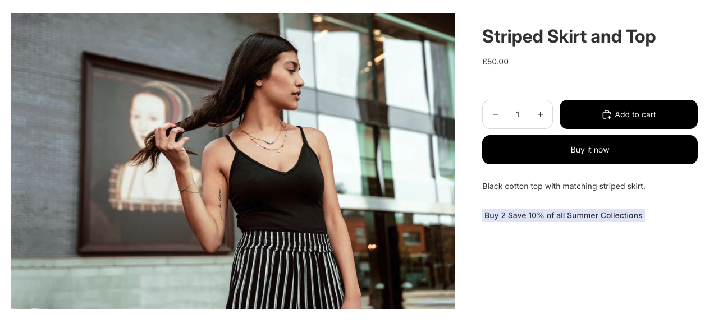

 # Urban Ember - Shopify Dev Store by Krishan.


[](https://anthonyradose.github.io/dev-worthy/#/)

[🔗 View the live project here.](https://krish-demostore.myshopify.com/)


This is the documentation for my demo Shopify store – an urban clothing brand using the Horizon theme and enhanced with custom features to improve user experience and merchant KPIs.
I have demonstrated how to apply these features using "out-the-box" configuration as well as code development. I hope you enjoy it.


# **Contents**
- [User Experience](#user-experience)
- [Core Shopify Features](#core-shopify-features)
	* [Metafield Custom Product Attribute](#metafield-custom-product-attribute)
 	* [Shopify Automatic Discount Buy X Get Y](#shopify-automatic-discount-buy-x-get-y)
- [Automation and Workflow](#automation-and-workflow)
	* [Shopify Flow - Automated Low Inventory Email Alert](#shopify-flow---automated-low-inventory-email-alert)
	* [Webhook Listener for Order Creation and Cart Creation](#webhook-listener-for-order-creation-and-cart-creation)
- [Advanced Shopify Development](#advanced-shopify-development)
    * [Homepage Video Banner](#homepage-video-banner)
    * [Cart Page Dynamic Free Shipping Message](#cart-page-dynamic-free-shipping-message)
    * [Collection page with a Liquid section](#collection-page-with-a-liquid-section)
   
- [SEO Optimisation](#seo-optimisation)
    * [Internal and External Links and SEO](#internal-and-external-links-and-seo)
    * [Sitemap XML](#sitemap-xml)
    * [Robots.txt](#robotstxt)
    * [Keyword Research](#keyword-research)

- [Performance](#performance)
        + [Google Lighthouse Score](#google-lighthouse-score)
        + [Microsoft Edge Lighthouse score](#microsoft-edge-lighthouse-score)

- [Bugs Encountered during Testing](#bugs-encountered-during-testing)
        + [Bug 1](#bug-1)
        + [Bug 2](#bug-2)
        + [Bug 3](#bug-3)
        + [Bug 4](#bug-4)
- [Accessibility](#accessibility)

- [Technologies used](#technologies-used)
    * [Languages](#languages)
    * [Frameworks and libraries](#frameworks-and-libraries)
    * [Databases](#databases)
    * [Other tools](#other-tools)
- [Credits and Borrowed Resources](#credits-and-borrowed-resources)
    * [GraphQL Admin API reference](#graphql-admin-api-reference)
    * [Shopify Development Fundamentals](#shopify-development-fundamentals)
    * [Tracking and adjusting inventory](#tracking-and-adjusting-inventory)

 


# User Experience
I selected the Horizon theme as the foundation for my demo store because it strikes a powerful balance between clean minimalism and conversion-focused features. It gives me enough flexibility to showcase my core understanding of shopify and knowledge of what an e-commerce store needs today.

# Core Shopify Features

## Metafield Custom Product Attribute

I added add custom product attributes using Shopify metafields and dynamic sources through the theme customizer - **no code editing required**.

### What Are Metafields?

Metafields are Shopify's way of storing custom data that doesn't fit into standard product fields. They allow you to add additional information like sustainability details, care instructions, sizing guides, or any other custom attributes to your products.

### Implementation Guide

### Step 1: Create Metafield Definition

1. Navigate to **Shopify Admin** → **Settings** → **Metafields**
2. Click **"Add definition"**
3. Configure your metafield:

| Field | Value | Notes |
|-------|-------|-------|
| **Name** | `Buy 2 Save 10% on all Summer Collections` | Human-readable label shown in admin |
| **Namespace and key** | `buy_2_save_10_of_all_summer_collections` | Technical identifier for the field |
| **Description** | `Buy 2 Save 10% on all Summer Collections` | Optional helper text |
| **Type** | `Single line text` | Data type - see options below |
| **Content type** | `Products` | Where this metafield can be used |

4. Click **"Save"**

### Step 2: Add Content to Products

1. Go to **Products** in Shopify admin
2. **Edit** the product you want to add the attribute to
3. Scroll to the **"Metafields"** section (usually near the bottom)
4. Find your **"Buy 2 Save 10% on all Summer Collections"** field
5. Enter your content (e.g., `Made from sustainable cotton.`)
6. **Save** the product

> **Tip:** You can bulk-edit metafields using CSV export/import for multiple products.

### Step 3: Display via Theme Customizer

1. Navigate to **Online Store** → **Themes** → **Customize**
2. Go to a **product page** in the preview
3. Add a new section or block:
   - Look for **"Custom content"**, **"Rich text"**, or **"Text"** blocks
   - Or use existing **"Product information"** sections
4. In the block settings, find text fields that support dynamic sources
5. Click the **"Connect dynamic source"** icon (🔗 chain link or database symbol)
6. Select **"Products"** → **"Buy 2 Save 10% on all Summer Collections"** (your metafield name)
7. **Save** your changes

### Step 4: Style and Position

- Use the **theme customizer** to position your block appropriately
- Adjust **text styling** (font size, color, alignment) through customizer settings
- **Preview** your changes across different devices
- **Publish** when satisfied



## Best Practices

### Naming Conventions

- **Names**: Use clear, descriptive names (`Sustainable Material`, `Care Instructions`)
- **Keys**: Use lowercase with underscores (`sustainable_material`, `care_instructions`)
- **Namespaces**: Stick with `custom` for simplicity, or create logical groups (`eco`, `sizing`)

### Content Guidelines

- Keep text concise and customer-focused
- Use consistent formatting across products
- Only populate metafields for relevant products
- Consider multiple languages if you have international customers

### Organization

- Group related metafields with consistent naming
- Use descriptions to document the purpose of each metafield
- Consider creating a content style guide for team members

## Bulk Management

### CSV Method

1. **Export products** via CSV from Products → Export
2. Add column: `Metafield: custom.sustainable_material [single_line_text_field]`
3. Fill in values for applicable products
4. **Import** the updated CSV

## Troubleshooting

### Common Issues

| Problem | Solution |
|---------|----------|
| **Metafield not appearing in admin** | Check metafield definition is saved and content type is "Products" |
| **Dynamic source option missing** | Verify your theme supports dynamic sources (most modern themes do) |
| **Content not displaying** | Ensure metafield has content and dynamic source is properly connected |
| **Styling issues** | Use theme customizer styling options rather than custom CSS |

[Back to contents](#contents)

---

## Shopify Automatic Discount Buy X Get Y

This guide shows you how to implement automatic cart discounts ("Buy 2, save 10%") using Shopify's native discount functionality. No custom development, apps, or Shopify Plus subscription required.

## Step-by-Step Setup

1. **Navigate to Discounts**
   - From your Shopify admin, go to **Discounts**
   - Click **Create discount**

2. **Select Discount Type**
   - Choose **"Buy X get Y"** from the discount type menu

3. **Choose Method**
   - **Automatic discount**: Applied automatically at cart and checkout

4. **Configure Customer Buys Section**
   ```
   Minimum quantity of items: 2
   From: collections
   ```

5. **Configure Customer Gets Section**
   - **For percentage discount**: 
     ```
     Quantity: Same items
     Discount: 10% off
     ```

6. **Set Additional Options**
   - **Maximum discount uses per order**: Leave blank for unlimited
   - I added a **Combination** setting so the discount does not combine with any other discount at checkout

7. **Save Your Discount**

[Back to contents](#contents)

---

## Homepage Video Banner
[](https://www.shopify.com/)
[](https://shopify.github.io/liquid/)
[](https://developer.mozilla.org/en-US/docs/Learn/CSS/CSS_layout/Responsive_Design)

> A custom Shopify Liquid section that creates a fullwidth video banner with autoplay functionality and customizable overlay content.

### ✨ Features

- 🎬 **Fullwidth video background** with autoplay, muted, and looped playback
- 🎨 **Customizable overlay** with adjustable opacity
- 🏷️ **Dynamic logo display** with size controls and optional white filter
- ✏️ **Editable text content** with typography controls (title and subtitle)
- 🔘 **Call-to-action button** with multiple styling options
- 📱 **Fully responsive** design optimized for mobile devices
- ✨ **Professional animations** with hover effects and smooth transitions

---

### 📦 Installation

1. In your Shopify admin, navigate to **Online Store > Themes**
2. Click **Actions > Edit code** on your active theme
3. In the **Sections** folder, click **Add a new section**
4. Name the file `video-banner.liquid`
5. Copy and paste the provided code into the file
6. Click **Save**

---

### Adding to Templates

Add the section to any template file using:
```liquid

```

---

### 🎥 Video Setup

1. Upload your video file to **Settings > Files** in Shopify admin
2. Copy the file URL from the Files section
3. In the theme customizer, navigate to the Video Banner section
4. Paste the video URL in the "Video URL" field
5. Optionally add a poster image for faster loading

---

### ⚙️ Customisation Options

The section includes comprehensive customization options accessible through the Shopify theme editor:

#### 🎬 Video Settings
- **Video URL**: Direct link to your uploaded video file
- **Video Poster Image**: Fallback image displayed before video loads

#### 🎨 Overlay Settings
- **Overlay Opacity**: Control background darkening (0-80%)
- **Text Color**: Set color for all overlay text

#### 🏷️ Logo Settings
- **Logo Upload**: Add your brand logo
- **Logo Width**: Control logo size (100-400px)
- **Convert to White**: Apply white filter for dark logos

#### ✏️ Text Settings
- **Title**: Main heading text
- **Title Font Size**: Typography control (24-72px)
- **Title Font Weight**: Choose from Light to Bold
- **Subtitle**: Supporting description text
- **Subtitle Font Size**: Typography control (14-24px)

#### 🔘 Button Settings
- **Button Text**: Call-to-action text
- **Button Link**: Destination URL
- **Button Style**: Choose between Filled or Outline
- **Button Color**: Background/border color
- **Button Text Color**: Text color for filled buttons
- **Button Font Size**: Typography control (12-20px)

---

## 🏗️ Technical Implementation

### File Structure
```
sections/
└── video-banner.liquid    # Main section file with Liquid, CSS, and Schema
```

### Code Architecture

The section consists of three main components:

1. **CSS Styles**: Embedded styles for layout, responsiveness, and animations
2. **HTML Structure**: Liquid template with video element and overlay content
3. **Schema Configuration**: JSON schema defining all customizable settings

---

## 📱 Responsive Design

The section automatically adapts to different screen sizes:
- **Desktop**: Full viewport height (100vh) with large typography
- **Mobile**: Reduced height (70vh) with scaled-down text and logo sizes

---

## 🛠️ Troubleshooting

### ❌ Common Issues and Solutions

#### Liquid Syntax Error: Unexpected character +

**Problem**: Shopify Liquid doesn't support the `+` operator for string concatenation.

```liquid
<!-- ❌ This causes an error -->
{{ section.settings.logo | img_url: section.settings.logo_width + 'x' }}
```

**Solution**: Use a fixed image size with CSS for scaling:

```liquid
<!-- ✅ This works correctly -->
{{ section.settings.logo | img_url: '400x' }}
<!-- Control size with CSS -->
style="max-width: {{ section.settings.logo_width }}px;"
```

**Why this happens**: Shopify Liquid uses different syntax than JavaScript. For string concatenation, use the `append` or `prepend` filters instead of `+`.

#### 🎥 Video Not Playing
- Ensure the video file is uploaded to Shopify Files
- Check that the video URL is correct and accessible
- Verify the video is in MP4 format for best browser compatibility
- Modern browsers require user interaction for autoplay with sound (this section uses muted autoplay)

#### ⚡ Performance Optimization
- Keep video files under 10MB for optimal loading
- Use poster images to improve perceived loading speed
- Consider using different video formats for different devices

---

## 🌐 Browser Compatibility

| Browser | Support | Notes |
|---------|---------|--------|
| Chrome | ✅ Full | Autoplay supported |
| Firefox | ✅ Full | Autoplay supported |
| Safari | ✅ Full | Autoplay supported |
| Edge | ✅ Full | Autoplay supported |
| Mobile Browsers | ✅ Full | Uses `playsinline` attribute |
| Older Browsers | ⚠️ Partial | Graceful fallback to poster image |

---

## 🔧 Development Notes

### Key Liquid Techniques Used
- `img_url` filter for responsive image sizing
- Conditional rendering with `` statements
- Dynamic CSS properties using Liquid variables
- Schema-driven customization options

### CSS Features
- CSS Grid and Flexbox for layout
- Object-fit for video scaling
- CSS custom properties for dynamic styling
- Mobile-first responsive design
- Smooth transitions and hover effects

[Back to contents](#contents)

---

# Cart Page Dynamic Free Shipping Message

## Overview
This guide will help you create a dynamic free shipping message on your Shopify cart page that updates based on the cart total, with full customization options through the theme editor and metafields integration.

---

## Step 1: Create Metaobjects for Configuration

### 1.1 Set up Free Shipping Configuration Metaobject
1. Go to **Settings > Metafields** in your Shopify admin
2. Click **Metaobjects** tab
3. Click **Add definition**
4. Configure the metaobject:
   - **Name**: `Free Shipping Config`
   - **Type**: `free_shipping_config`
   - **Access**: `Storefront API`

### 1.2 Add Fields to the Metaobject
Add these fields to your metaobject:

| Field Name | Type | Key | Description |
|------------|------|-----|-------------|
| Minimum Amount | Money | `minimum_amount` | Free shipping threshold |
| Eligible Message | Single line text | `eligible_message` | Message when customer qualifies |
| Progress Message | Single line text | `progress_message` | Message showing remaining amount |
| Countries | Single line text | `countries` | Eligible countries (comma-separated) |

**Note:** The full field keys will be:
- `free_shipping_config.minimum_amount`
- `free_shipping_config.eligible_message` 
- `free_shipping_config.progress_message`
- `free_shipping_config.countries`

### 1.3 Create Metaobject Entry
1. After saving the definition, click **Add entry**
2. Fill in the values:
   - **Minimum Amount**: £50.00
   - **Eligible Message**: "🎉 You qualify for FREE shipping!"
   - **Progress Message**: "Add £{amount} more for FREE shipping!"
   - **Countries**: "GB,UK"

## Step 2: Create the Liquid Section

### 2.1 Create the Section File
Create a new file: `sections/free-shipping-message.liquid`

## Step 3: Create the Shipping Icon

### 3.1 Create Icon Snippet
Create a new file: `snippets/icon-shipping.liquid`

## Step 4: Add to Cart Template

### 4.1 Modify Cart Template
Edit your `templates/cart.liquid` file and add this line where you want the message to appear (typically near the cart total).

### 4.2 Alternative: Add to Cart Drawer
If using a cart drawer, add the section include to your cart drawer template or snippet.

## Step 5: Set Up Global Metafields (Optional Enhancement)

### 5.1 Create Global Shop Metafield
1. Go to **Settings > Metafields**
2. Click **Shop** tab
3. Add definition:
   - **Name**: `Free Shipping Enabled`
   - **Namespace and key**: `custom.free_shipping_enabled`
   - **Type**: `True or false`
   - **Description**: `Enable/disable free shipping message globally`

### 5.2 Update Section to Use Global Setting
Add this liquid at the top of your section:

```liquid

   Don't show if globally disabled 
  <style>.free-shipping-message { display: none !important; }</style>

```
## Step 6: Testing and Configuration

### 6.1 Theme Customizer Setup
1. Go to **Online Store > Themes**
2. Click **Customize** on your Horizon theme
3. Navigate to your cart page
4. You should see the "Free Shipping Message" section available to configure

### 6.2 Test Scenarios
Test these scenarios:
- Cart total below threshold (should show progress message)
- Cart total above threshold (should show eligible message)
- Empty cart (should show full amount needed)
- Progress bar animation when adding/removing items

### 6.3 Metaobject Configuration
1. Test with metaobject values
2. Test fallback to section settings
3. Update threshold amounts and messages
4. Test different currencies if applicable

---

## Critical Issues Encountered

### Issue #1: Liquid Syntax Parsing Errors

**Problem:**
```
FileSaveError: Liquid syntax error (line 42): Variable '{{ progress_message | replace: '{amount}' was not properly terminated with regexp: /\}\}/
```

**Root Cause:**
The Liquid parser was attempting to process JavaScript template strings that contained Liquid-like syntax within `<script>` tags. When JavaScript code contained `{{ progress_message }}`, the Liquid engine tried to parse it as Liquid code rather than JavaScript, causing syntax conflicts.

**Initial Failed Attempts:**
1. Escaping the curly braces - didn't resolve parsing conflicts
2. Moving variables to data attributes - helped but didn't fully resolve the JavaScript issue
3. Using different quote styles - had no effect on Liquid parsing

**Final Solution:**
Complete separation of Liquid and JavaScript concerns:
```liquid
<!-- Liquid handles initial rendering -->


<p class="free-shipping-message__text">
  {{ message_parts[0] }}{{ remaining_formatted }}{{ message_parts[1] }}
</p>

<!-- JavaScript handles dynamic updates -->
<script>
// No Liquid syntax within JavaScript blocks
var formattedRemaining = '£' + (remaining / 100).toFixed(2);
</script>
```

### Issue #2: Section-in-Section Architecture Limitation

**Problem:**
```
Liquid error (sections/main-cart line 29): Cannot render sections inside sections
```

**Root Cause:**
Shopify's architecture prevents rendering sections within other sections. The `main-cart.liquid` template is already a section, so using `` inside it violates this constraint.

**Failed Approaches:**
1. Direct section rendering within cart section
2. Attempting to bypass with different syntax variations
3. Trying to render as partial instead of section

**Solution Path:**
Implemented a hybrid approach:
```liquid
<!-- Convert to snippet for direct integration -->


<!-- Then later converted to standalone section -->
<!-- Added through theme customizer interface -->
```

### Issue #3: Metaobject Field Access Confusion

**Problem:**
Initial code used incorrect field access patterns:
```liquid
<!-- Incorrect -->
assign threshold = free_shipping_config.minimum_amount.value | times: 100

<!-- User's actual field structure -->
free_shipping_config.minimum_amount
free_shipping_config.eligible_message
free_shipping_config.progress_message
free_shipping_config.countries
```

**Root Cause:**
Misunderstanding of how metaobject fields are accessed in Liquid. The user's metaobject definition used direct field access without the `.value` suffix.

**Solution:**
Corrected field access pattern:
```liquid
<!-- Correct approach -->
assign threshold = free_shipping_config.minimum_amount | times: 100
assign eligible_message = free_shipping_config.eligible_message
assign progress_message = free_shipping_config.progress_message
```

### Issue #4: Schema Validation Errors

**Problem 1: Name Length Limit**
```
FileSaveError: Invalid schema: name is too long (max 25 characters)
```

**Solution:**
```json
// Before: "Cart Free Shipping Message" (26 characters)
// After: "Cart Free Shipping" (18 characters)
"name": "Cart Free Shipping"
```

**Problem 2: Block Type Conflicts**
```
FileSaveError: Theme blocks and section-defined blocks can not be used together
```

**Root Cause:**
Attempting to mix Shopify's built-in block types (`@theme`, `@app`) with custom section-defined blocks in the same schema.

**Solution:**
Abandoned the block-based approach within existing cart section and used standalone section architecture instead.

### Issue #5: Dynamic Updates Not Working in Theme Customizer

**Problem:**
When adding the section through the theme customizer, JavaScript cart updates weren't being detected properly, causing the message to not update when cart contents changed.

**Root Cause:**
Different themes use different cart update mechanisms. The Horizon theme's cart drawer system wasn't triggering the standard cart update events our JavaScript was listening for.

**Solution:**
Implemented multiple event listeners and fetch interception:
```javascript
// Multiple event detection strategies
document.addEventListener('cart:updated', updateHandler);
document.addEventListener('cart:refresh', updateHandler);

// Fetch API interception for broader coverage
var originalFetch = window.fetch;
window.fetch = function() {
  return originalFetch.apply(this, arguments).then(function(response) {
    if (arguments[0] && arguments[0].includes('/cart/')) {
      setTimeout(updateHandler, 200);
    }
    return response;
  });
};
```
---

## 📋 Debugging Strategies Used

### 1. Liquid Syntax Debugging
```liquid
<!-- Debug output to identify parsing issues -->
{{ progress_message | json }}
{{ remaining | money | json }}
```

### 2. JavaScript Console Debugging
```javascript
console.log('Cart total:', cartTotal);
console.log('Threshold:', threshold);
console.log('Message element:', messageElement);
```

### 3. Schema Validation Testing
- Character counting for name limits
- JSON syntax validation
- Block type compatibility checking

### 4. Event Listener Testing
```javascript
// Test multiple event sources
document.addEventListener('cart:updated', function() {
  console.log('cart:updated fired');
});

document.addEventListener('cart:refresh', function() {
  console.log('cart:refresh fired');
});
```

---

## 🎯 Key Lessons Learned

### 1. Shopify Architecture Constraints
- Sections cannot be nested within sections
- Theme blocks and custom blocks cannot coexist
- Metaobject field access varies by implementation

### 2. Liquid-JavaScript Separation
- Keep Liquid processing separate from JavaScript execution
- Use data attributes for Liquid-to-JavaScript data transfer
- Avoid Liquid syntax within script blocks

### 3. Event Detection Strategies
- Different themes use different cart update mechanisms
- Multiple event listeners provide better coverage
- Fetch API interception catches programmatic cart changes

### 4. Schema Design Considerations
- Name length limits (25 characters)
- Block type compatibility requirements
- Setting organization for user experience

[Back to contents](#contents)

# Webhook Listener for Order Creation and Cart Creation 

This is a simple **Node.js + Express** server for capturing Shopify webhooks in real-time. I've demonstrated how to set up webhook listeners for **Order Creation** and **Cart Creation** events, with **ngrok** used to expose the local server and **Chalk** for clean, color-coded logging in the terminal.  

---

## 🚀 Features  
- Webhook listener for **orders/create**  
- Webhook listener for **carts/create**  
- Browser check endpoints to confirm the server is live  
- Color-coded logs with [Chalk](https://www.npmjs.com/package/chalk)  
- Ngrok tunneling for connecting local server to Shopify  

---

## 🛠️ Setup  

1. **Clone the repository**  
   ```bash
   git clone <your-repo-url>
   cd <project-folder>

2. **Install dependencies**
   ```bash
   npm install express chalk

3. **Run Server**
   ```bash
   node server.js

   By default, the app runs on http://localhost:3000 

4. **Expose the server with ngrok**
   ```bash
   ngrok http 3000

   Copy the generated HTTPS forwarding URL

5. **Register webhooks in Shopify Admin**
   - Go to Shopify Admin > Settings > Notifications > Webhooks

   Add a webhook for:
   - Order creation → https://abcd1234.ngrok.io/order/create
   - Cart creation → https://abcd1234.ngrok.io/cart/create

  ---

## 📦 Code Overview

### Order Webhook (`/order/create`)
- Captures new order events  
- Logs **Order ID**, **Customer Email**, and **Total Price**

### Cart Webhook (`/cart/create`)
- Captures new cart creation events  
- Logs **Cart Token**, **Customer ID**, and **Total Price**

👉 Both webhooks pretty-print the **full JSON payload** for debugging.

---

## ⚠️ Errors Encountered

### 1. Ngrok Tunnel Expired
- **Cause:** Free ngrok sessions expire after some hours  
- **Fix:** Restart ngrok and update the webhook URL in Shopify  

### 2. Shopify Webhook Failing with 401 or Timeout
- **Cause:** Shopify couldn’t reach your local server  
- **Fix:** Make sure ngrok is running and the server is active  

### 3. Empty Payloads
- **Cause:** Request body was not parsed  
- **Fix:** Added `app.use(express.json())` middleware in Express  

### 4. Confusing Logs
- **Cause:** Raw JSON payloads were hard to read  
- **Fix:** Added Chalk for colored logs and used:
  ```js
  console.dir(payload, { depth: null, colors: true });

  ---

## 📖 Example Logs

**Order Webhook**


**Cart Webhook** 


[Back to contents](#contents)

# Collection page with a Liquid section

I created a seasonal collection page for a summer collection. This seasonal collection template includes:

<ul>
  <li>The collection title</li>
  <li>The collection description</li>
  <li>A call-to-action section for customers to pre-order now</li>
  <li>A product grid with all the products in the collection</li>
</ul>

## Step 1: Create a manual collection in the Shopify Admin page
- In the Shopify Admin page, select Products > Collection > Create collection to create a summer collection with an enticing description.
- Click Save and add a few products from your store to this collection.

## Step 2 Create a new collection template in the theme editor
- Head over to the theme editor. At the top of the page, click the Home Page drop down menu.
- Select Collections and select "Create template"
- Name the template “Summer Collection”.

## Step 3 Create a new section in the web code editor
- Head to the web code editor by clicking the ... menu and select Edit code. I createe a custom collection banner for a seasonal collection.
- Scroll through the menu bar. Under 📁 Sections, select + Add a new section. Leave the radio button on ‘liquid’ and make the file name call-to-action.liquid

## Step 4 Add the Liquid Code
The call-to-action file should includes:
- A section title. The title is a field that the merchant can input in the theme editor.
- The collection title for that page. For example, If the template is used for the winter collection, it could similarly display “The winter collection is out now!”.
- A text area for Lily to input additional information on pre-orders for her seasonal collections.

```bash
<div>
	<h2>{{ section.settings.pre-order-title }}</h2>

	The new {{ collection.title }} is out now! {{ section.settings.pre-order-text }}
</div>										  

{
"name": "Call to action",
"settings": [
	{
	"id": "pre-order-title",
	"type": "text",
	"label": "Title",
	"default": "Pre-order now!"
	},
	{
	"id": "pre-order-text",
	"type": "textarea",
	"label": "Text",
	"default": "Enter text here"
	}
]
,
"presets": [
	{
	"name": "Call to Action",
	"category": "Promotional"
	}
]
}

```

## Step 5 Create a new section in the web code editor
- In the Templates folder, you should see a new JSON file called collection.seasonal-collection.json file.
- Add the call-to-action section to the JSON template.
``` bash

{
  "sections": {
    "banner": {
      "type": "main-collection-banner",
      "settings": {
        "show_collection_description": true,
        "show_collection_image": false,
        "color_scheme": "scheme-1"
      }
    },
    "call-to-action": {
      "type": "call-to-action",
      "settings": {
      }
    },
    "product-grid": {
      "type": "main-collection-product-grid",
      "settings": {
        "products_per_page": 16,
        "columns_desktop": 4,
        "color_scheme": "",
        "image_ratio": "adapt",
        "image_shape": "default",
        "show_secondary_image": false,
        "show_vendor": false,
        "show_rating": false,
        "quick_add": "none",
        "enable_filtering": true,
        "filter_type": "horizontal",
        "enable_sorting": true,
        "columns_mobile": "2",
        "padding_top": 36,
        "padding_bottom": 36
      }
    }
  },
  "order": [
    "banner",
    "call-to-action",
    "product-grid"
  ]
}
```

## Step 6 Use the new template in your collection
- Head back to the Admin page and Select the summer collection to make edits.
- Under Theme template, select seasonal-collection as your new collection template.

## Step 7 Surface all collections in the main menu

 -In the Admin page, navigate to Sales channels > Online Store > Navigation.
- Click on the Main menu under Menus.
- Click Edit alongside Featured Collections and select All Collections.
- Click Apply changes then Save menu. Next time you preview your theme, you should see all collections.

## Additional enhancements

I wanted add controls over the text alignment and font weight from the Theme Editor, with flexibility to expand styling options without editing CSS every time.

## Step 1
- I added settings to the sections/call-to-action.liquid for alignment and font weight.
```bash

{
  "name": "Custom Block",
  "settings": [
    {
      "type": "select",
      "id": "text_alignment",
      "label": "Text alignment",
      "options": [
        { "value": "left", "label": "Left" },
        { "value": "center", "label": "Center" },
        { "value": "right", "label": "Right" }
      ],
      "default": "left"
    },
    {
      "type": "select",
      "id": "font_weight",
      "label": "Font weight",
      "options": [
        { "value": "normal", "label": "Normal" },
        { "value": "bold", "label": "Bold" },
        { "value": "lighter", "label": "Light" }
      ],
      "default": "normal"
    }
  ],
  "blocks": [
    {
      "type": "text",
      "name": "Text Block",
      "settings": [
        { "type": "text", "id": "text", "label": "Text content" }
      ]
    }
  ],
  "presets": [
    {
      "name": "Custom Block"
    }
  ]
}

```

## Step 2
- Output inline styles dynamically. Inside the block/section markup, I used the settings:
```bash
  <div class="custom-block"
     style="text-align: {{ section.settings.text_alignment }};
            font-weight: {{ section.settings.font_weight }};">
  {{ block.settings.text }}
  </div>
```

## Step 3
- I Add classes instead of inline styles which are cleaner & easier to manage with Tailwind/CSS):
```bash
<div class="custom-block
            align-{{ section.settings.text_alignment }}
            weight-{{ section.settings.font_weight }}">
  {{ block.settings.text }}
</div>
```

## Step 4
- Then I updated the base.CSS file:
```bash
.align-left { text-align: left; }
.align-center { text-align: center; }
.align-right { text-align: right; }

.weight-normal { font-weight: normal; }
.weight-bold { font-weight: bold; }
.weight-lighter { font-weight: lighter; }
```
[Back to contents](#contents)

# Shopify Flow - Automated Low Inventory Email Alert

A low-code solution for automatically notifying staff when product inventory drops below a specified threshold using Shopify Flow.

## Overview

This implementation creates an automated workflow that monitors product inventory levels and sends email notifications to staff members when stock falls below a defined threshold. Perfect for maintaining optimal inventory levels without manual monitoring.

## Prerequisites

- Shopify store with admin access
- Shopify Flow app installed
- Staff email addresses for notifications
- Defined inventory threshold (e.g., 5, 10, or 15 units)

## Implementation Steps

### 1. Access Shopify Flow
- Navigate to Shopify Admin → Apps → Shopify Flow
- Click "Create workflow"

### 2. Configure Trigger
- Select **"Product inventory changed"** as the trigger
- This monitors inventory levels across all products in real-time

### 3. Set Condition
- Add condition: `Product inventory quantity` `is less than or equal to` `[threshold number]`
- Replace `[threshold number]` with your desired minimum stock level
- Optional: Add additional conditions for specific products, variants, or locations

### 4. Configure Email Action
- Choose **"Send email"** as the action
- Configure email settings:
  - **To**: Staff email addresses (comma-separated for multiple recipients)
  - **Subject**: `Low Inventory Alert - {{product.title}}`
  - **Body**: Use the template below

### 5. Email Template

```
Subject: Low Inventory Alert - {{product.title}}

Hi Team,

The inventory for {{product.title}} has dropped to {{product.totalInventory}} units.

Product Details: <br>
- SKU: {{product.handle}} <br> 
- Current Stock: {{product.totalInventory}} <br>
- Product ID: {{product.id}} <br>
- Storefront Link: https://krish-demostore.myshopify.com/products/{{product.handle}} <br>

Please restock when convenient.

From UE Team
```

### 6. Test and Activate
- Use Shopify Flow's built-in test functionality
- Verify email delivery and content
- Activate workflow once testing is complete

## Available Variables

### Working Variables for Products Without Variants
- `{{product.title}}` - Product name
- `{{product.totalInventory}}` - Current stock level
- `{{product.id}}` - Product ID (GraphQL format)
- `{{product.handle}}` - Product URL handle

## Known Limitations and Workarounds

### 1. GraphQL ID Format Issue
**Problem**: `{{product.id}}` returns GraphQL format (`gid://shopify/Product/123456`) instead of numeric ID.

**Impact**: Cannot create clean admin product URLs like `https://admin.shopify.com/store/name/products/123456`

**Workaround**: Use storefront URLs instead: `https://your-store.myshopify.com/products/{{product.handle}}`

### 2. SKU Limitations
**Problem**: SKU variables are not accessible for products without variants.

**Workaround**: Use Product ID and Handle for product identification instead.

### 3. Admin URL Generation
**Problem**: Cannot generate direct admin product links due to GraphQL ID format.

**Workaround**: Include Product ID in email for manual admin search, or use storefront links.

## Best Practices

### Multiple Alert Levels
Consider creating separate workflows for different urgency levels:
- Critical: ≤ 2 units (immediate action required)
- Low: ≤ 10 units (reorder soon)
- Warning: ≤ 25 units (plan reorder)

### Business Hours Filtering
Add time-based conditions to avoid after-hours notifications:
- Only send emails during business hours
- Different alert thresholds for weekends

### Product-Specific Thresholds
Create targeted workflows for:
- High-value products (lower thresholds)
- Seasonal items (adjusted thresholds)
- Fast-moving inventory (higher thresholds)

## Troubleshooting

### Common Issues
1. **Variable errors**: Ensure all variables are from the approved list above
2. **No emails received**: Check spam folders and verify email addresses
3. **Too many notifications**: Consider implementing delay conditions or higher thresholds
4. **Missing products**: Verify inventory tracking is enabled for products

### Testing
- Used Shopify Flow's test feature before activation
- Test with a single email address initially


## Technical Notes

- **Theme Independence**: This workflow functions regardless of store theme (tested with Horizon theme)
- **Real-time Monitoring**: Triggers immediately when inventory changes
- **Scalability**: Handles multiple products and locations
- **No Coding Required**: Pure low-code/no-code solution

[Back to contents](#contents)

# Credits and Borrowed Resources

- [GraphQL Admin API reference](https://shopify.dev/docs/api/admin-graphql "This page will help you get up and running with Shopify’s GraphQL API")
- [Shopify Development Fundamentals](https://www.shopifyacademy.com/path/shopify-development-fundamentals "Learn Shopify's framework and the necessary steps to start developing on Shopify’s platform.")
- [Tracking and adjusting inventory](https://help.shopify.com/en/manual/products/inventory/managing-inventory-quantities/track_inventory#view-your-product-inventory "Keeping track of your inventory is essential for running your business efficiently")
- https://help.shopify.com/en/manual/discounts/discount-types/buy-x-get-y#automatic-buy-x-get-y


[Back to contents](#contents)
