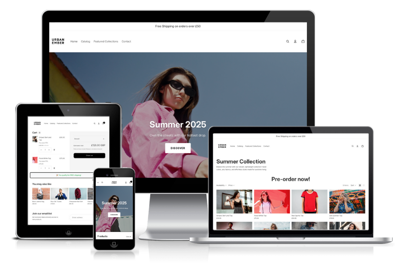
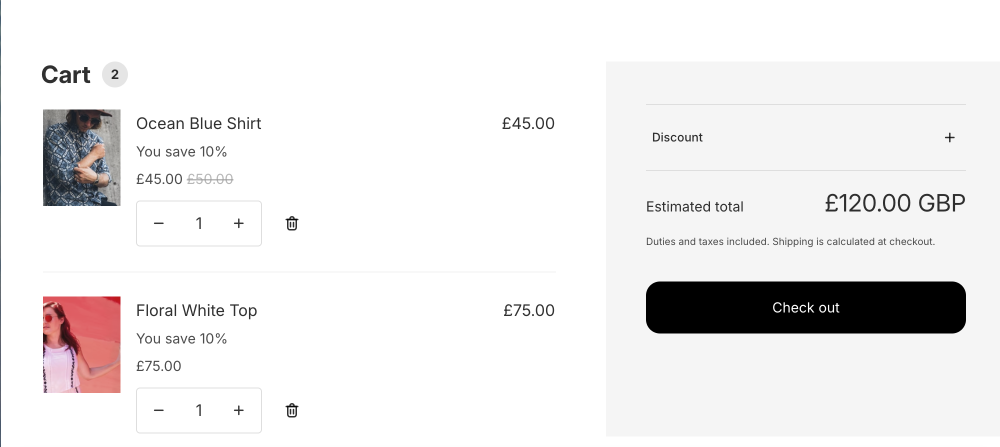

<h1 align="center">Urban Ember - Shopify Dev Store by Krishan.</h1>



[🔗 View the live project here.](https://krish-demostore.myshopify.com/)


This is the documentation for my demo Shopify store – an urban clothing brand using the Horizon theme and enhanced with custom features to improve user experience and merchant KPIs.
I have demonstrated how to apply these features using "out-the-box" configuration as well as code development. I hope you enjoy it.


# Contents
- [User Experience](#user-experience)
- [Core Shopify Features](#core-shopify-features)
	* [Metafield Custom Product Attribute](#metafield-custom-product-attribute)
 	* [Shopify Automatic Discount Buy X Get Y](#shopify-automatic-discount-buy-x-get-y)
- [Automation and Workflow](#automation-and-workflow)
	* [Shopify Flow - Automated Low Inventory Email Alert](#shopify-flow---automated-low-inventory-email-alert)
	* [Webhook Listener for Order Creation and Cart Creation](#webhook-listener-for-order-creation-and-cart-creation)
		+ [CLI Setup of the Webhook](#cli-setup-of-the-webhook)
   		+ [Code Overview for the Webhook](#code-overview-for-the-webhook)
   		+ [Issues Encountered with the Webhooks](#issues-encountered-with-the-webhooks)
   		+ [Bug 1](#bug-1)
   		+ [Bug 2](#bug-2)
   		+ [Bug 3](#bug-3)	
- [Advanced Shopify Development](#advanced-shopify-development)
	* [Homepage Video Banner](#homepage-video-banner)
      	+ [Video Banner Implementation Guide](#video-banner-implementation-guide)
      	+ [Adding to Templates](#adding-to-templates)
      	+ [Video Setup](#video-setup)
      	+ [Customisation Options](#customisation-options)
      	+ [Technical Implementation](#technical-implementation)
      	+ [Responsive Design](#responsive-design)
      	+ [Browser Compatibility](#browser-compatibility)
      	+ [Issue Encountered](#issue-encountered)
    * [Cart Page Dynamic Free Shipping Message](#cart-page-dynamic-free-shipping-message)
      	+ [Dynamic Message Implementation Guide](#dynamic-message-implementation-guide)
      	+ [Testing and Configuration for Dynamic Cart Message](#testing-and-configuration-for-dynamic-cart-message)
      	+ [Issues Encountered for Dynamic Cart Message](#issues-encountered-for-dynamic-cart-message)
      	+ [Debugging Strategies Used](#debugging-strategies-used)
      	+ [Key Lessons Learned](#key-lessons-learned)
    * [Collection page with a Liquid section](#collection-page-with-a-liquid-section)
- [Headless Storefront](#headless-storefront)
  	* [Issues Encountered](#issues-encountered)
  	  	+ [Issue 1](#issue-1)
  	   	+ [Issue 2](#issue-2)
	
- [SEO Optimisation](#seo-optimisation)
    * [Page-Level SEO Settings](#page-level-seo-settings)
    * [Store-Wide Settings](#store-wide-settings)

- [Performance](#performance)
  * [Google Lighthouse Score](#google-lighthouse-score)
 
- [Credits and Borrowed Resources](#credits-and-borrowed-resources)

--- 

# User Experience
I selected the Horizon theme as the foundation for my demo store because it strikes a powerful balance between clean minimalism and conversion-focused features. It gives me enough flexibility to showcase my core understanding of shopify and knowledge of what an e-commerce store needs today.

---

# Core Shopify Features

## Metafield Custom Product Attribute

I added add custom product attributes using Shopify metafields and dynamic sources through the theme customiser - `no code editing required`.

### What Are Metafields?

Metafields are Shopify's way of storing custom data that doesn't fit into standard product fields. They allow you to add additional information like sustainability details, care instructions, sizing guides, or any other custom attributes to your products.

### Step 1: Create Metafield Definition

1. Navigate to `Shopify Admin` → `Settings` → `Metafields`
2. Click `"Add definition"`
3. Configure your metafield:

| Field | Value | Notes |
|-------|-------|-------|
| `Name` | `Buy 2 Save 10% on all Summer Collections` | Human-readable label shown in admin |
| `Namespace and key` | `buy_2_save_10_of_all_summer_collections` | Technical identifier for the field |
| `Description` | `Buy 2 Save 10% on all Summer Collections` | Optional helper text |
| `Type` | `Single line text` | Data type - see options below |
| `Content type` | `Products` | Where this metafield can be used |

4. Click `"Save"`

### Step 2: Add Content to Products

1. Go to `Products` in Shopify admin
2. `Edit` the product you want to add the attribute to
3. Scroll to the `"Metafields"` section (usually near the bottom)
4. Find your `"Buy 2 Save 10% on all Summer Collections"` field
5. Enter your content (e.g., `Made from sustainable cotton.`)
6. `Save` the product

> `Tip:` You can bulk-edit metafields using CSV export/import for multiple products.

### Step 3: Display via Theme customiser

1. Navigate to `Online Store` → `Themes` → `customise`
2. Go to a `product page` in the preview
3. Add a new section or block:
   - Look for `"Custom content"`, `"Rich text"`, or `"Text"` blocks
   - Or use existing `"Product information"` sections
4. In the block settings, find text fields that support dynamic sources
5. Click the `"Connect dynamic source"` icon (🔗 chain link or database symbol)
6. Select `"Products"` → `"Buy 2 Save 10% on all Summer Collections"` (your metafield name)
7. `Save` your changes

### Step 4: Style and Position

- Use the `theme customiser` to position your block appropriately
- Adjust `text styling` (font size, color, alignment) through customiser settings
- `Preview` your changes across different devices
- `Publish` when satisfied


[Back to contents](#contents)

---

## Shopify Automatic Discount Buy X Get Y

This guide shows you how to implement automatic cart discounts ("Buy 2, save 10%") using Shopify's native discount functionality. No custom development, apps, or Shopify Plus subscription required.

### Implementation Guide

1. `Navigate to Discounts`
   - From your Shopify admin, go to `Discounts`
   - Click `Create discount`

2. `Select Discount Type`
   - Choose `"Buy X get Y"` from the discount type menu

3. `Choose Method`
   - `Automatic discount`: Applied automatically at cart and checkout

4. `Configure Customer Buys Section`
   ```
   Minimum quantity of items: 2
   From: collections
   ```

5. `Configure Customer Gets Section`
   - `For percentage discount`: 
     ```
     Quantity: Same items
     Discount: 10% off
     ```

6. `Set Additional Options`
   - `Maximum discount uses per order`: Leave blank for unlimited
   - I added a `Combination` setting so the discount does not combine with any other discount at checkout

7. `Save Your Discount`



[Back to contents](#contents)

---

# Advanced Shopify Development

## Homepage Video Banner

- A custom Shopify Liquid section that creates a fullwidth video banner with autoplay functionality and customizable overlay content.

### Features

- 🎬 `Fullwidth video background` with autoplay, muted, and looped playback
- 🎨 `Customizable overlay` with adjustable opacity
- 🏷️ `Dynamic logo display` with size controls and optional white filter
- ✏️ `Editable text content` with typography controls (title and subtitle)
- 🔘 `Call-to-action button` with multiple styling options
- 📱 `Fully responsive` design optimized for mobile devices
- ✨ `Professional animations` with hover effects and smooth transitions

### Video Banner Implementation Guide

1. In the Shopify admin, navigate to `Online Store` > `Themes`
2. Click `Actions` > `Edit code` on your active theme
3. In the `Sections` folder, click `Add a new section`
4. Name the file `video-banner.liquid`
5. Copy and paste the provided code into the file
6. Click Save

### Adding to Templates

- Add the section to any template file using:
```liquid

```

### Video Setup

1. Upload your video file to `Settings` > `Files` in Shopify admin
2. Copy the file URL from the Files section
3. In the theme customiser, navigate to the Video Banner section
4. Paste the video URL in the `Video URL` field
5. Optionally add a poster image for faster loading

### Customisation Options:

The section includes comprehensive customisation options accessible through the Shopify theme editor:

#### Video Settings
- `Video URL`: Direct link to your uploaded video file
- `Video Poster Image`: Fallback image displayed before video loads

#### Overlay Settings
- `Overlay Opacity`: Control background darkening (0-80%)
- `Text Color`: Set color for all overlay text

#### Logo Settings
- `Logo Upload`: Add your brand logo
- `Logo Width: Control logo size (100-400px)
- `Convert to White`: Apply white filter for dark logos

#### Text Settings
- `Title`: Main heading text
- `Title Font Size`: Typography control (24-72px)
- `Title Font Weight`: Choose from Light to Bold
- `Subtitle`: Supporting description text
- `Subtitle Font Size`: Typography control (14-24px)

#### Button Settings
- `Button Text`: Call-to-action text
- `Button Link`: Destination URL
- `Button Style`: Choose between Filled or Outline
- `Button Color`: Background/border color
- `Button Text Color`: Text color for filled buttons
- `Button Font Size`: Typography control (12-20px)


## Technical Implementation

### File Structure
```
sections/
└── video-banner.liquid    # Main section file with Liquid, CSS, and Schema
```

### Code Architecture

The section consists of three main components:

1. `CSS Styles`: Embedded styles for layout, responsiveness, and animations
2. `HTML Structure`: Liquid template with video element and overlay content
3. `Schema Configuration`: JSON schema defining all customizable settings

## Responsive Design

The section automatically adapts to different screen sizes:
- `Desktop`: Full viewport height (100vh) with large typography
- `Mobile`: Reduced height (70vh) with scaled-down text and logo sizes

## Browser Compatibility

| Browser | Support | Notes |
|---------|---------|--------|
| Chrome | ✅ Full | Autoplay supported |
| Firefox | ✅ Full | Autoplay supported |
| Safari | ✅ Full | Autoplay supported |
| Edge | ✅ Full | Autoplay supported |
| Mobile Browsers | ✅ Full | Uses `playsinline` attribute |
| Older Browsers | ⚠️ Partial | Graceful fallback to poster image |

# Issue Encountered

I copied the code into the blank liquid file and then clicked save. However, it did not save and i got this error message.

```
FileSaveError: Liquid syntax error (line 157): Unexpected character + in "{{ section.settings.logo | img_url: section.settings.logo_width + 'x' }}"
```

I used the `+` operator to concatenate strings in Liquid, but Shopify's Liquid doesn't support the `+` operator for string concatenation, like JavaScript or other programming languages do.

## Fix

Instead of trying to dynamically concatenate the width value with 'x', I did the following:

- Used a fixed large size ('400x') for the img_url filter to ensure high quality
- Applied the actual size control through inline CSS using style="max-width: {{ section.settings.logo_width }}px;"

[Back to contents](#contents)

---

# Cart Page Dynamic Free Shipping Message

- I created a dynamic free shipping message on the cart page that updates dynamically based on the cart total. This includes customisation options through the theme editor and metafields integration.

## Dynamic Message Implementation Guide

## 1: Create Metaobjects for Configuration

### 1.1 Set up Free Shipping Configuration Metaobject
1. Go to `Settings > Metafields` in your Shopify admin
2. Click `Metaobjects` tab
3. Click `Add definition`
4. Configure the metaobject:
   - `Name`: `Free Shipping Config`
   - `Type`: `free_shipping_config`
   - `Access`: `Storefront API`

### 1.2 Add Fields to the Metaobject
Add these fields to your metaobject:

| Field Name | Type | Key | Description |
|------------|------|-----|-------------|
| Minimum Amount | Money | `minimum_amount` | Free shipping threshold |
| Eligible Message | Single line text | `eligible_message` | Message when customer qualifies |
| Progress Message | Single line text | `progress_message` | Message showing remaining amount |
| Countries | Single line text | `countries` | Eligible countries (comma-separated) |

`Note:` The full field keys will be:
- `free_shipping_config.minimum_amount`
- `free_shipping_config.eligible_message` 
- `free_shipping_config.progress_message`
- `free_shipping_config.countries`

### 1.3 Create Metaobject Entry
1. After saving the definition, click `Add entry`
2. Fill in the values:
   - `Minimum Amount`: £50.00
   - `Eligible Message`: "🎉 You qualify for FREE shipping!"
   - `Progress Message`: "Add £{amount} more for FREE shipping!"
   - `Countries`: "GB,UK"

## Step 2: Create the Liquid Section

### 2.1 Create the Section File
Create a new file: `sections/free-shipping-message.liquid`

## Step 3: Create the Shipping Icon (optional)

### 3.1 Create Icon Snippet
Create a new file: `snippets/icon-shipping.liquid`

## Step 4: Add to Cart Template

### 4.1 Modify Cart Template
Edit your `templates/cart.liquid` file and add this line where you want the message to appear (typically near the cart total).

### 4.2 Alternative: Add to Cart Drawer
If using a cart drawer, add the section include to your cart drawer template or snippet.

## Step 5: Set Up Global Metafields (Optional Enhancement)

### 5.1 Create Global Shop Metafield
1. Go to `Settings > Metafields`
2. Click `Shop` tab
3. Add definition:
   - `Name`: `Free Shipping Enabled`
   - `Namespace and key`: `custom.free_shipping_enabled`
   - `Type`: `True or false`
   - `Description`: `Enable/disable free shipping message globally`

### 5.2 Update Section to Use Global Setting
Add this liquid at the top of your section:

```liquid

   Don't show if globally disabled 
  <style>.free-shipping-message { display: none !important; }</style>

```
## Testing and Configuration for Dynamic Cart Message 

### 6.1 Theme customiser Setup
1. Go to `Online Store > Themes`
2. Click `customise` on your Horizon theme
3. Navigate to your cart page
4. You should see the "Free Shipping Message" section available to configure

### 6.2 Test Scenarios
Tested using these scenarios:
- Cart total below threshold (should show progress message)
- Cart total above threshold (should show eligible message)
- Empty cart (should show full amount needed)
- Progress bar animation when adding/removing items

### 6.3 Metaobject Configuration
1. Test with metaobject values
2. Test fallback to section settings
3. Update threshold amounts and messages
4. Test different currencies if applicable

---

## Issues Encountered for Dynamic Cart Message

### Issue #1: Liquid Syntax Parsing Errors

`Problem:`
```
FileSaveError: Liquid syntax error (line 42): Variable '{{ progress_message | replace: '{amount}' was not properly terminated with regexp: /\}\}/
```

`Root Cause:`
The Liquid parser was attempting to process JavaScript template strings that contained Liquid-like syntax within `<script>` tags. When JavaScript code contained `{{ progress_message }}`, the Liquid engine tried to parse it as Liquid code rather than JavaScript, causing syntax conflicts.

`Initial Failed Attempts:`
1. Escaping the curly braces - didn't resolve parsing conflicts
2. Moving variables to data attributes - helped but didn't fully resolve the JavaScript issue
3. Using different quote styles - had no effect on Liquid parsing

`Final Solution:`
Complete separation of Liquid and JavaScript concerns:
```liquid
<!-- Liquid handles initial rendering -->


<p class="free-shipping-message__text">
  {{ message_parts[0] }}{{ remaining_formatted }}{{ message_parts[1] }}
</p>

<!-- JavaScript handles dynamic updates -->
<script>
// No Liquid syntax within JavaScript blocks
var formattedRemaining = '£' + (remaining / 100).toFixed(2);
</script>
```

### Issue #2: Section-in-Section Architecture Limitation

`Problem:`
```
Liquid error (sections/main-cart line 29): Cannot render sections inside sections
```

`Root Cause:`
Shopify's architecture prevents rendering sections within other sections. The `main-cart.liquid` template is already a section, so using `` inside it violates this constraint.

`Failed Approaches:`
1. Direct section rendering within cart section
2. Attempting to bypass with different syntax variations
3. Trying to render as partial instead of section

`Solution Path:`
Implemented a hybrid approach:
```liquid
<!-- Convert to snippet for direct integration -->


<!-- Then later converted to standalone section -->
<!-- Added through theme customiser interface -->
```

### Issue #3: Metaobject Field Access Confusion

`Problem:`
Initial code used incorrect field access patterns:
```liquid
<!-- Incorrect -->
assign threshold = free_shipping_config.minimum_amount.value | times: 100

<!-- User's actual field structure -->
free_shipping_config.minimum_amount
free_shipping_config.eligible_message
free_shipping_config.progress_message
free_shipping_config.countries
```

`Root Cause:`
Misunderstanding of how metaobject fields are accessed in Liquid. The user's metaobject definition used direct field access without the `.value` suffix.

`Solution:`
Corrected field access pattern:
```liquid
<!-- Correct approach -->
assign threshold = free_shipping_config.minimum_amount | times: 100
assign eligible_message = free_shipping_config.eligible_message
assign progress_message = free_shipping_config.progress_message
```

### Issue #4: Schema Validation Errors

`Problem 1: Name Length Limit`
```
FileSaveError: Invalid schema: name is too long (max 25 characters)
```

`Solution:`
```json
// Before: "Cart Free Shipping Message" (26 characters)
// After: "Cart Free Shipping" (18 characters)
"name": "Cart Free Shipping"
```

`Problem 2: Block Type Conflicts`
```
FileSaveError: Theme blocks and section-defined blocks can not be used together
```

`Root Cause:`
Attempting to mix Shopify's built-in block types (`@theme`, `@app`) with custom section-defined blocks in the same schema.

`Solution:`
Abandoned the block-based approach within existing cart section and used standalone section architecture instead.

### Issue #5: Dynamic Updates Not Working in Theme customiser

`Problem:`
When adding the section through the theme customiser, JavaScript cart updates weren't being detected properly, causing the message to not update when cart contents changed.

`Root Cause:`
Different themes use different cart update mechanisms. The Horizon theme's cart drawer system wasn't triggering the standard cart update events our JavaScript was listening for.

`Solution:`
Implemented multiple event listeners and fetch interception:
```javascript
// Multiple event detection strategies
document.addEventListener('cart:updated', updateHandler);
document.addEventListener('cart:refresh', updateHandler);

// Fetch API interception for broader coverage
var originalFetch = window.fetch;
window.fetch = function() {
  return originalFetch.apply(this, arguments).then(function(response) {
    if (arguments[0] && arguments[0].includes('/cart/')) {
      setTimeout(updateHandler, 200);
    }
    return response;
  });
};
```
---

## Debugging Strategies Used

### 1. Liquid Syntax Debugging
```liquid
<!-- Debug output to identify parsing issues -->
{{ progress_message | json }}
{{ remaining | money | json }}
```

### 2. JavaScript Console Debugging
```javascript
console.log('Cart total:', cartTotal);
console.log('Threshold:', threshold);
console.log('Message element:', messageElement);
```

### 3. Schema Validation Testing
- Character counting for name limits
- JSON syntax validation
- Block type compatibility checking

### 4. Event Listener Testing
```javascript
// Test multiple event sources
document.addEventListener('cart:updated', function() {
  console.log('cart:updated fired');
});

document.addEventListener('cart:refresh', function() {
  console.log('cart:refresh fired');
});
```

## Key Lessons Learned

### 1. Shopify Architecture Constraints
- Sections cannot be nested within sections
- Theme blocks and custom blocks cannot coexist
- Metaobject field access varies by implementation

### 2. Liquid-JavaScript Separation
- Keep Liquid processing separate from JavaScript execution
- Use data attributes for Liquid-to-JavaScript data transfer
- Avoid Liquid syntax within script blocks

### 3. Event Detection Strategies
- Different themes use different cart update mechanisms
- Multiple event listeners provide better coverage
- Fetch API interception catches programmatic cart changes

### 4. Schema Design Considerations
- Name length limits (25 characters)
- Block type compatibility requirements
- Setting organization for user experience

[Back to contents](#contents)

---

# Webhook Listener for Order Creation and Cart Creation 

This is a simple `Node.js + Express` server for capturing Shopify webhooks in real-time. I've demonstrated how to set up webhook listeners for `Order Creation` and `Cart Creation` events, with `ngrok` used to expose the local server and `Chalk` for clean, color-coded logging in the terminal.

## Features  
- Webhook listener for `orders/create`  
- Webhook listener for `carts/create`  
- Browser check endpoints to confirm the server is live  
- Color-coded logs with [Chalk](https://www.npmjs.com/package/chalk)  
- Ngrok tunneling for connecting local server to Shopify  

## CLI Setup of the Webhook

1. `Clone the repository`  
   ```bash
   git clone <your-repo-url>
   cd <project-folder>

2. `Install dependencies`
   ```bash
   npm install express chalk

3. `Run Server`
   ```bash
   node server.js

   By default, the app runs on http://localhost:3000 

4. `Expose the server with ngrok`
   ```bash
   ngrok http 3000

   Copy the generated HTTPS forwarding URL

5. `Register webhooks in Shopify Admin`
   - Go to Shopify Admin > Settings > Notifications > Webhooks

   Add a webhook for:
   - Order creation → https://abcd1234.ngrok.io/order/create
   - Cart creation → https://abcd1234.ngrok.io/cart/create

## Code Overview for the Webhook 

### Order Webhook (`/order/create`)
- Captures new order events  
- Logs `Order ID`, `Customer Email`, and `Total Price`

### Cart Webhook (`/cart/create`)
- Captures new cart creation events  
- Logs `Cart Token`, `Customer ID`, and `Total Price`

👉 Both webhooks pretty-print the `full JSON payload` for debugging.

## Issues Encountered with the Webhooks

### Bug 1

This error returned when I 'ngrok http 300' 

```
ERROR: authentication failed: Usage of ngrok requires a verified account and authtoken. 
ERROR: Sign up for an account: https://dashboard.ngrok.com/signup
ERROR: Install your authtoken: https://dashboard.ngrok.com/get-started/your-authtoken
ERROR: ERR_NGROK_4018
ERROR: https://ngrok.com/docs/errors/err_ngrok_4018
```

ngrok needed me to sign up for a (free) account and link it with an authtoken before you can start tunnels.

- Add the authtoken to your local ngrok
```
ngrok config add-authtoken YOUR_TOKEN_HERE
```

- It’ll save the token to `~/.ngrok2/ngrok.yml` or `~/.config/ngrok/ngrok.yml` depending on version.

- Now you can run `ngrok http 3000`

You should see something like:
```
Forwarding    https://a1b2c3d4.ngrok.io -> http://localhost:3000
```

### Bug 2

When I go to the URL I got  error `Cannot GET /order/create`

-That’s actually expected and it’s a good sign.

- You set up your Node.js server to handle POST requests (Shopify sends POST requests for webhooks).

- When you go to the URL in a browser, your browser is sending a GET request, but your server has no app.get('/order/create') route, so Express replies with “Cannot GET”.

- It means your server is running fine — it’s just that the /order/create route only responds to POST requests from Shopify.

### Bug 3

I got this error when trying to view the payload: 
```
ERR_NGROK_8012 Traffic was successfully tunneled to the ngrok agent,
but the agent failed to establish a connection to the upstream web service at http://localhost:3000.
The error encountered was: dial tcp [::1]:3000: connect: connection refused
```

Ah, that error means ngrok is working, but it can’t reach your Node.js server on `localhost:3000`.
So Shopify (or your browser) hits the ngrok URL, ngrok tries to forward the request to your computer, but there’s nothing listening at port `3000` > so it says connection refused.

## Example Logs

`Order Webhook`
`Cart Webhook` 

[Back to contents](#contents)

---

# Collection page with a Liquid section

I created a seasonal collection page for a summer collection. This seasonal collection template includes:

<ul>
  <li>The collection title</li>
  <li>The collection description</li>
  <li>A call-to-action section for customers to pre-order now</li>
  <li>A product grid with all the products in the collection</li>
</ul>

## Step 1: Create a manual collection in the Shopify Admin page
- In the Shopify Admin page, select Products > Collection > Create collection to create a summer collection with an enticing description.
- Click Save and add a few products from your store to this collection.

## Step 2 Create a new collection template in the theme editor
- Head over to the theme editor. At the top of the page, click the Home Page drop down menu.
- Select Collections and select "Create template"
- Name the template “Summer Collection”.

## Step 3 Create a new section in the web code editor
- Head to the web code editor by clicking the ... menu and select Edit code. I createe a custom collection banner for a seasonal collection.
- Scroll through the menu bar. Under 📁 Sections, select + Add a new section. Leave the radio button on ‘liquid’ and make the file name call-to-action.liquid

## Step 4 Add the Liquid Code
The call-to-action file should includes:
- A section title. The title is a field that the merchant can input in the theme editor.
- The collection title for that page. For example, If the template is used for the winter collection, it could similarly display “The winter collection is out now!”.
- A text area for Lily to input additional information on pre-orders for her seasonal collections.

```bash
<div>
	<h2>{{ section.settings.pre-order-title }}</h2>

	The new {{ collection.title }} is out now! {{ section.settings.pre-order-text }}
</div>										  

{
"name": "Call to action",
"settings": [
	{
	"id": "pre-order-title",
	"type": "text",
	"label": "Title",
	"default": "Pre-order now!"
	},
	{
	"id": "pre-order-text",
	"type": "textarea",
	"label": "Text",
	"default": "Enter text here"
	}
]
,
"presets": [
	{
	"name": "Call to Action",
	"category": "Promotional"
	}
]
}

```

## Step 5 Create a new section in the web code editor
- In the Templates folder, you should see a new JSON file called collection.seasonal-collection.json file.
- Add the call-to-action section to the JSON template.
``` bash

{
  "sections": {
    "banner": {
      "type": "main-collection-banner",
      "settings": {
        "show_collection_description": true,
        "show_collection_image": false,
        "color_scheme": "scheme-1"
      }
    },
    "call-to-action": {
      "type": "call-to-action",
      "settings": {
      }
    },
    "product-grid": {
      "type": "main-collection-product-grid",
      "settings": {
        "products_per_page": 16,
        "columns_desktop": 4,
        "color_scheme": "",
        "image_ratio": "adapt",
        "image_shape": "default",
        "show_secondary_image": false,
        "show_vendor": false,
        "show_rating": false,
        "quick_add": "none",
        "enable_filtering": true,
        "filter_type": "horizontal",
        "enable_sorting": true,
        "columns_mobile": "2",
        "padding_top": 36,
        "padding_bottom": 36
      }
    }
  },
  "order": [
    "banner",
    "call-to-action",
    "product-grid"
  ]
}
```

## Step 6 Use the new template in your collection
- Head back to the Admin page and Select the summer collection to make edits.
- Under Theme template, select seasonal-collection as your new collection template.

## Step 7 Surface all collections in the main menu

 -In the Admin page, navigate to Sales channels > Online Store > Navigation.
- Click on the Main menu under Menus.
- Click Edit alongside Featured Collections and select All Collections.
- Click Apply changes then Save menu. Next time you preview your theme, you should see all collections.

## Additional enhancements

I wanted add controls over the text alignment and font weight from the Theme Editor, with flexibility to expand styling options without editing CSS every time.

## Step 1
- I added settings to the sections/call-to-action.liquid for alignment and font weight.
```bash

{
  "name": "Custom Block",
  "settings": [
    {
      "type": "select",
      "id": "text_alignment",
      "label": "Text alignment",
      "options": [
        { "value": "left", "label": "Left" },
        { "value": "center", "label": "Center" },
        { "value": "right", "label": "Right" }
      ],
      "default": "left"
    },
    {
      "type": "select",
      "id": "font_weight",
      "label": "Font weight",
      "options": [
        { "value": "normal", "label": "Normal" },
        { "value": "bold", "label": "Bold" },
        { "value": "lighter", "label": "Light" }
      ],
      "default": "normal"
    }
  ],
  "blocks": [
    {
      "type": "text",
      "name": "Text Block",
      "settings": [
        { "type": "text", "id": "text", "label": "Text content" }
      ]
    }
  ],
  "presets": [
    {
      "name": "Custom Block"
    }
  ]
}

```

## Step 2
- Output inline styles dynamically. Inside the block/section markup, I used the settings:
```bash
  <div class="custom-block"
     style="text-align: {{ section.settings.text_alignment }};
            font-weight: {{ section.settings.font_weight }};">
  {{ block.settings.text }}
  </div>
```

## Step 3
- I Add classes instead of inline styles which are cleaner & easier to manage with Tailwind/CSS):
```bash
<div class="custom-block
            align-{{ section.settings.text_alignment }}
            weight-{{ section.settings.font_weight }}">
  {{ block.settings.text }}
</div>
```

## Step 4
- Then I updated the base.CSS file:
```bash
.align-left { text-align: left; }
.align-center { text-align: center; }
.align-right { text-align: right; }

.weight-normal { font-weight: normal; }
.weight-bold { font-weight: bold; }
.weight-lighter { font-weight: lighter; }
```
[Back to contents](#contents)

---

# Automation and Workflow

## Shopify Flow - Automated Low Inventory Email Alert

A low-code solution for automatically notifying staff when product inventory drops below a specified threshold using Shopify Flow.

### Overview

This implementation creates an automated workflow that monitors product inventory levels and sends email notifications to staff members when stock falls below a defined threshold. Perfect for maintaining optimal inventory levels without manual monitoring.

### Prerequisites

- Shopify store with admin access
- Shopify Flow app installed
- Staff email addresses for notifications
- Defined inventory threshold (e.g., 5, 10, or 15 units)

### Implementation Steps

### 1. Access Shopify Flow
- Navigate to Shopify Admin → Apps → Shopify Flow
- Click "Create workflow"

### 2. Configure Trigger
- Select `"Product inventory changed"` as the trigger
- This monitors inventory levels across all products in real-time

### 3. Set Condition
- Add condition: `Product inventory quantity` `is less than or equal to` `[threshold number]`
- Replace `[threshold number]` with your desired minimum stock level
- Optional: Add additional conditions for specific products, variants, or locations

### 4. Configure Email Action
- Choose `"Send email"` as the action
- Configure email settings:
  - `To`: Staff email addresses (comma-separated for multiple recipients)
  - `Subject`: `Low Inventory Alert - {{product.title}}`
  - `Body`: Use the template below

### 5. Email Template

```
Subject: Low Inventory Alert - {{product.title}}

Hi Team,

The inventory for {{product.title}} has dropped to {{product.totalInventory}} units.

Product Details: <br>
- SKU: {{product.handle}} <br> 
- Current Stock: {{product.totalInventory}} <br>
- Product ID: {{product.id}} <br>
- Storefront Link: https://krish-demostore.myshopify.com/products/{{product.handle}} <br>

Please restock when convenient.

From UE Team
```

### 6. Test and Activate
- Use Shopify Flow's built-in test functionality
- Verify email delivery and content
- Activate workflow once testing is complete

## Available Variables

### Working Variables for Products Without Variants
- `{{product.title}}` - Product name
- `{{product.totalInventory}}` - Current stock level
- `{{product.id}}` - Product ID (GraphQL format)
- `{{product.handle}}` - Product URL handle

## Known Limitations and Workarounds

### 1. GraphQL ID Format Issue
`Problem`: `{{product.id}}` returns GraphQL format (`gid://shopify/Product/123456`) instead of numeric ID.

`Impact`: Cannot create clean admin product URLs like `https://admin.shopify.com/store/name/products/123456`

`Workaround`: Use storefront URLs instead: `https://your-store.myshopify.com/products/{{product.handle}}`

### 2. SKU Limitations
`Problem`: SKU variables are not accessible for products without variants.

`Workaround`: Use Product ID and Handle for product identification instead.

### 3. Admin URL Generation
`Problem`: Cannot generate direct admin product links due to GraphQL ID format.

`Workaround`: Include Product ID in email for manual admin search, or use storefront links.

## Best Practices

### Multiple Alert Levels
Consider creating separate workflows for different urgency levels:
- Critical: ≤ 2 units (immediate action required)
- Low: ≤ 10 units (reorder soon)
- Warning: ≤ 25 units (plan reorder)

### Business Hours Filtering
Add time-based conditions to avoid after-hours notifications:
- Only send emails during business hours
- Different alert thresholds for weekends

### Product-Specific Thresholds
Create targeted workflows for:
- High-value products (lower thresholds)
- Seasonal items (adjusted thresholds)
- Fast-moving inventory (higher thresholds)

## Troubleshooting

### Common Issues
1. `Variable errors`: Ensure all variables are from the approved list above
2. `No emails received`: Check spam folders and verify email addresses
3. `Too many notifications`: Consider implementing delay conditions or higher thresholds
4. `Missing products`: Verify inventory tracking is enabled for products

### Testing
- Used Shopify Flow's test feature before activation
- Test with a single email address initially


## Technical Notes

- `Theme Independence`: This workflow functions regardless of store theme (tested with Horizon theme)
- `Real-time Monitoring`: Triggers immediately when inventory changes
- `Scalability`: Handles multiple products and locations
- `No Coding Required`: Pure low-code/no-code solution

[Back to contents](#contents)

---

# Headless Storefront

This is a headless commerce demo alongside my existing store. I decided to create a separate sales channel with a dedicated page. I can use this for flash sales or exclusive offers for VIP customer segments, for example.

What It Does:
- ✅ Fetches real products from Shopify via GraphQL Storefront API<br>
- ✅ Displays products in a modern grid layout<br>
- ✅ Shopping cart functionality (stored in memory during session)<br>
- ✅ Add to cart with quantities<br>
- ✅ Completely independent from the Urban Ember store<br>
- ✅ Mobile responsive design<br>

This demonstrates decoupled architecture. This storefront is completely independent from the Urban Ember Horizon theme. My products are being served via API and not through the traditional Shopify theme system.

## Created a Custom Storefront Channel

- In Shopify Admin → Settings → Apps and sales channels
- Add a custom app for your headless storefront
- This gives you separate API credentials (Storefront API access tokens)
- Your existing store continues running on the Horizon theme completely untouched


## Built a Simple Headless Demo

I created a simeple headless storefront in HTML:

- This uses the Shopify's Storefront API (GraphQL)
- This fetches and displays the existing products
- Will show cart functionality
- Demonstrates the "headless" concept clearly
- Can be hosted anywhere (Netlify, Vercel, GitHub Pages, or even locally).


## Created the Custom App

- Click "Create an app" button
- Gave it a name "Headless Storefront Demo"
- Click "Create app"
- Configured API Scopes: Click "Configure Storefront API scopes" > Enabled these scopes (minimum needed):
``
unauthenticated_read_product_listings
unauthenticated_read_product_inventory
unauthenticated_read_product_tags
unauthenticated_write_checkouts
unauthenticated_read_checkouts
``
## Install the app and add Storefront API access token to the HTML

- Click "Install app"
- This generates your API credentials
- Replace `YOUR_STORE_NAME` with your actual store name (e.g., if your store is demo-store.myshopify.com, use demo-store)
- Replace `YOUR_STOREFRONT_ACCESS_TOKEN` with the Storefront API access token.


## Issues Encountered:

### Issue 1 

#### I had to set up the distribution method first.

When I clicked "Install App", I got redirected to the Install App page and saw this error and asking me to open access for the app:


### Fix

1. Went into the Shopify Dev Dashboard
2. In the Distribution section > selected Custom distribution


### Issue 2

#### Error: Products not loading on the Frontend - "The installation link for this app is invalid"

I loaded the frontend of the store and I saw the error message rendered rendered. This error shows if the products fail to load.


I then realised I may not have installed the app to the store. I clicked 'Install App' and was direct this this error message


I need to add the `Storefront API access token`. I was trying to look for the API access token but I could only see the Client ID and secret instead. I also tried to refresh the token below but was still seeing the error on the frontend.


I still coudn't seem to find the API access token and seems to be a common issue in the shopify community: <br>
`https://community.shopify.com/t/admin-api-access-token-for-shopify-partner-app/370386/2`

I saw this setting to open the Storefront API:

- Dev Dashboard > Settings > Storefront API > Manage > Open / Request Access


### Fix

- Manual API Call - I created a simple HTML tool that uses the Admin API credentials to generate the Storefront token.


Filled in the form with:

- `Store Name`: Just the store name part (e.g., if your store is mystore.myshopify.com, enter mystore)
- `Client ID`: Copy from your Credentials page (the one you showed: caf83142013c6c30cb7909a8ec7867dd)
- `Client Secret`: Click the eye icon 👁️ next to "Secret" in Shopify admin to reveal it, then copy and paste

2. Click "Generate Storefront Token"

The tool uses the Admin API credentials to create a Storefront API token, and displayed the token when successful.

3. Copy the generated token

- Use the "Copy Token" button and then pasted it into the `Headless Storefront Demo` code.
- The products were then loading.

[Back to contents](#contents)

---

# SEO Optimisation

Shopify has robust native SEO features built into the platform. Here's what I set up directly in my Horizon theme store without any apps.

## Page-Level SEO Settings

For Products, Collections, Pages:

- Title tags and Meta Descriptions - Edit via `Search engine listing` section at the bottom of each product/collection/page
- URL handles - Clean, keyword-rich URLs that you can edit when creating or editing items

## Store-Wide Settings

Homepage & Store Settings:

- Homepage title and meta description: Sales Channels > Online Store > Preferences > Social sharing image and SEO

[Back to contents](#contents)

---

# Performance

## Google Lighthouse Score


[Back to contents](#contents)

---

# Credits and Borrowed Resources

- [GraphQL Admin API reference](https://shopify.dev/docs/api/admin-graphql "This page will help you get up and running with Shopify’s GraphQL API")
- [Shopify Development Fundamentals](https://www.shopifyacademy.com/path/shopify-development-fundamentals "Learn Shopify's framework and the necessary steps to start developing on Shopify’s platform.")
- [Tracking and adjusting inventory](https://help.shopify.com/en/manual/products/inventory/managing-inventory-quantities/track_inventory#view-your-product-inventory "Keeping track of your inventory is essential for running your business efficiently")
- [Discount Types](https://help.shopify.com/en/manual/discounts/discount-types/buy-x-get-y#automatic-buy-x-get-y)
- [Vibe Coding Using Chat GPT](https://chatgpt.com/)
- [Vibe Coding Using Claude.ai](https://claude.ai/new)
- [Markdown Guide](https://www.markdownguide.org/)
- [Royalty Free Images and Videos](https://www.pexels.com/)

[Back to contents](#contents)

---

<h2 align="center">End of Readme</h2>
